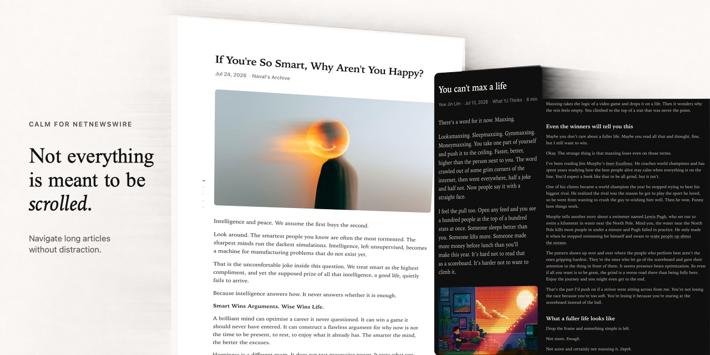
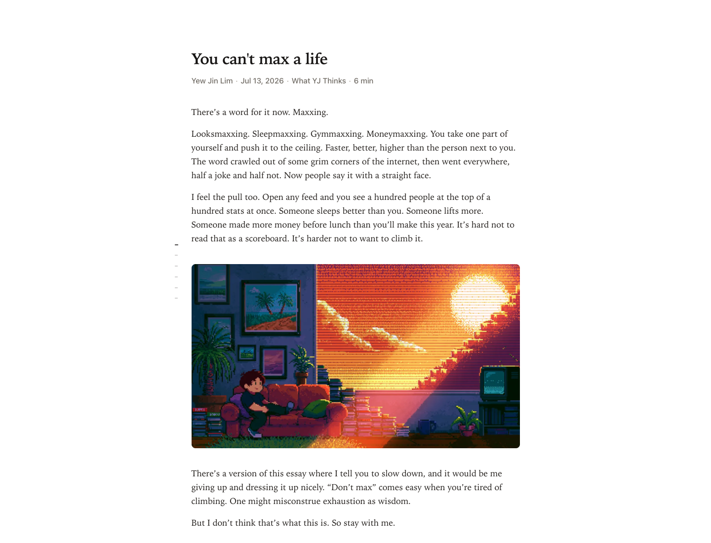
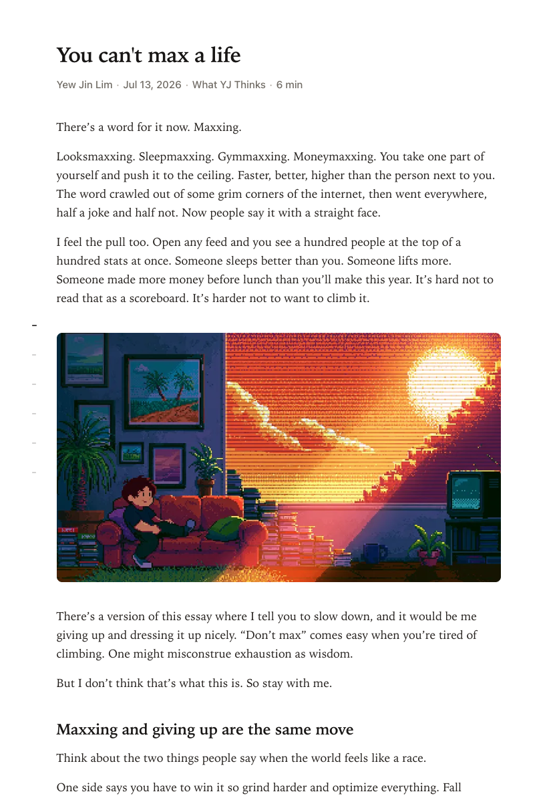
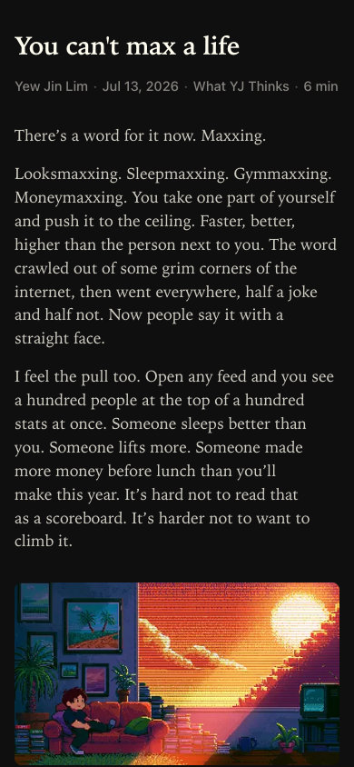

# Calm

<picture>
  <source media="(max-width: 600px)" srcset="assets/social-preview-mobile.jpg">
  
</picture>

**Navigate long articles without distraction.**

Calm is a NetNewsWire theme that adapts its reading map to the article. On wider
Mac and iPad layouts, structured pieces become a heading map while simpler
pieces get five quiet depth markers. Tap a marker or scrub the rail to move
through the article. On iPhone, Split View, and short landscape layouts, the map
disappears entirely.

The reading surface stays deliberately familiar: a narrow serif column, strong
editorial headings, restrained links, soft source metadata, and system light
and dark appearances.

[Install](#install) ·
[Latest release](https://github.com/raisulchowdhury/calm-nnwtheme/releases/latest) ·
[Report a theme issue](https://github.com/raisulchowdhury/calm-nnwtheme/issues/new?template=theme_issue.yml) ·
[Contribute](CONTRIBUTING.md)

## What makes Calm different

Calm's typography sets the mood. The reading map is the product idea.

- It reads the article first. Five or more major headings become real section
  destinations; simpler posts use evenly spaced depth markers instead of a
  forced table of contents.
- It supports direct navigation. Click or tap a marker to jump, or drag along
  the rail to scrub through the article. Wide Mac layouts reveal the active
  section name only while you interact.
- It knows when to leave. The rail sits outside the unchanged reading measure on
  wide layouts, uses 44-point targets on iPad, and is removed completely from
  compact layouts.
- It keeps secondary information quiet. Source identity stays visible, reading
  time appears only for articles estimated at four minutes or longer, and
  there is no persistent progress bar, word count, or statistics footer.

## Screenshots

| Desktop light | Desktop dark |
| --- | --- |
|  |  |

| Structured article | iPad |
| --- | --- |
|  |  |

| iPhone light | iPhone dark |
| --- | --- |
|  |  |

Screenshots use
[“If You’re So Smart, Why Aren’t You Happy?”](https://navalsarchive.substack.com/p/if-youre-so-smart-why-arent-you-happy)
from Naval’s Archive and
[“You Can’t Max a Life”](https://yewjin.substack.com/p/you-cant-max-a-life)
by Yew Jin Lim.

## Install

### iPhone and iPad

GitHub removes non-HTTPS links from rendered Markdown. Copy the full installer
URL below, paste it into Safari's address bar, and confirm that you want to open
NetNewsWire:

```text
netnewswire://theme/add?url=https%3A%2F%2Fgithub.com%2Fraisulchowdhury%2Fcalm-nnwtheme%2Freleases%2Flatest%2Fdownload%2FCalm.nnwtheme.zip
```

NetNewsWire then fetches the package itself, so the release asset must be
publicly accessible without a GitHub login. Opening the raw zip in Safari or the
GitHub app only downloads it; opening the full `netnewswire://` URL invokes
NetNewsWire's theme installer.

### macOS

Paste the same installer URL into Safari, run it from Terminal with `open`, or
download the latest package and open the bundle manually:

```sh
open 'netnewswire://theme/add?url=https%3A%2F%2Fgithub.com%2Fraisulchowdhury%2Fcalm-nnwtheme%2Freleases%2Flatest%2Fdownload%2FCalm.nnwtheme.zip'
```

[Calm.nnwtheme.zip](https://github.com/raisulchowdhury/calm-nnwtheme/releases/latest/download/Calm.nnwtheme.zip)

```sh
unzip Calm.nnwtheme.zip
open Calm.nnwtheme
```

The repository also keeps the current package at
[Calm.nnwtheme.zip](Calm.nnwtheme.zip). NetNewsWire documents the bundle format
and installer URL in its
[theme technote](https://github.com/Ranchero-Software/NetNewsWire/blob/main/Technotes/Themes.md).

## Compatibility

Calm follows NetNewsWire's documented theme bundle format and uses only the
HTML, CSS, and JavaScript supported by that reader surface. Automated checks
cover the theme on macOS runners, while the preview matrix covers desktop,
iPad, Split View, iPhone, light, dark, precise-pointer, and coarse-pointer
layouts.

NetNewsWire and WebKit updates can still affect rendering. When reporting an
issue, include your device, OS version, NetNewsWire version, Calm version,
window mode, text size, and a screenshot.

## How it works

Calm uses the system serif stack that best matches Apple's reader surfaces:

```css
"Iowan Old Style", "Charter", "Bitstream Charter", "Sitka Text", Cambria, Georgia, "Times New Roman", Times, serif
```

The theme includes:

- system light and dark mode
- iOS Dynamic Type support with a small Calm-specific size bump
- an article-aware reading map beside the centered column on wider screens
- major-heading destinations for structured articles and scroll-depth markers
  for simpler articles
- click, tap, keyboard, and Tap + Scrub navigation
- an intent-revealed active-section label on wide, precise-pointer layouts
- 44-point marker targets and marker-only feedback on iPad
- a rail-free compact layout for phone, Split View, and short coarse landscape
- textual source identity and conditional reading time in the opening metadata
- no persistent statistics footer or visible word count
- image blending in light mode
- restrained code, table, blockquote, and figure styling

## Development

The source theme lives in:

```text
Calm.nnwtheme/
```

The bundle must contain exactly:

```text
Info.plist
stylesheet.css
template.html
```

Validate changes:

```sh
scripts/validate.sh
```

The validator uses standard macOS tools (`plutil`, `ditto`, and `unzip`) plus
Node.js. GitHub Actions runs the same suite for every pull request and every
push to `main`.

The validation runner checks:

- `Info.plist` syntax
- theme and preview inline JavaScript syntax
- theme and preview inline JavaScript parity
- responsive title hierarchy and article-relative rail geometry
- compact rail removal, touch-capable interaction targets, and keyboard focus
- conditional reading time, robust metadata separators, and footer removal
- heading-only intent labels, coarse-pointer suppression, and reduced motion
- release version, documentation, and shipped screenshot synchronization
- root zip content against `Calm.nnwtheme/`

Build an installable zip:

```sh
ditto -c -k --norsrc --keepParent Calm.nnwtheme Calm.nnwtheme.zip
```

The root `Calm.nnwtheme.zip` is committed for direct access. GitHub Releases
publish that same rebuilt file.

## Preview

The local preview page is only for screenshots and quick visual checks:

```text
preview/index.html
```

It uses the real theme stylesheet from `Calm.nnwtheme/stylesheet.css`.

## Support

Use the
[Calm issue form](https://github.com/raisulchowdhury/calm-nnwtheme/issues/new?template=theme_issue.yml)
for theme-specific rendering or interaction problems. If the same problem
appears in NetNewsWire's built-in themes, report it to the
[NetNewsWire project](https://github.com/Ranchero-Software/NetNewsWire/issues/new/choose).

Pull requests are welcome. See [CONTRIBUTING.md](CONTRIBUTING.md) for the
project's design constraints, test matrix, and packaging rules.

## Credits

Made by Raisul Chowdhury.

Calm is not affiliated with NetNewsWire or Ranchero Software.

## License

MIT. See [LICENSE](LICENSE). Community participation is covered by the
[Code of Conduct](CODE_OF_CONDUCT.md), and security reports should follow
[SECURITY.md](SECURITY.md).
