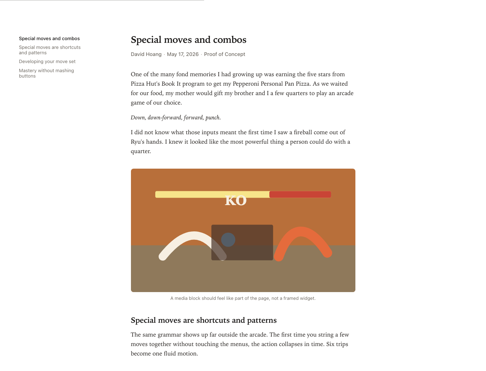
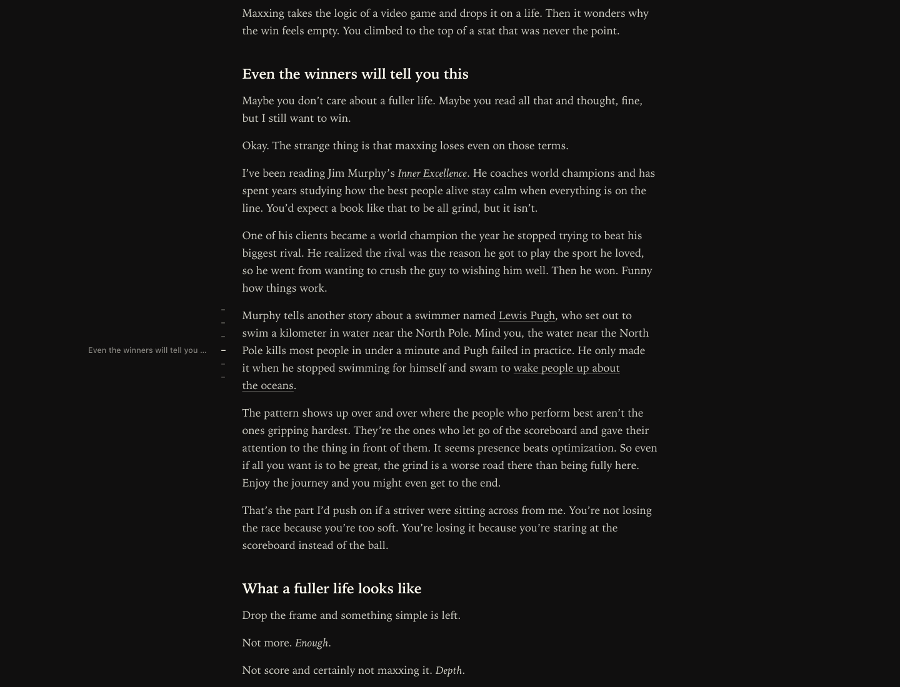
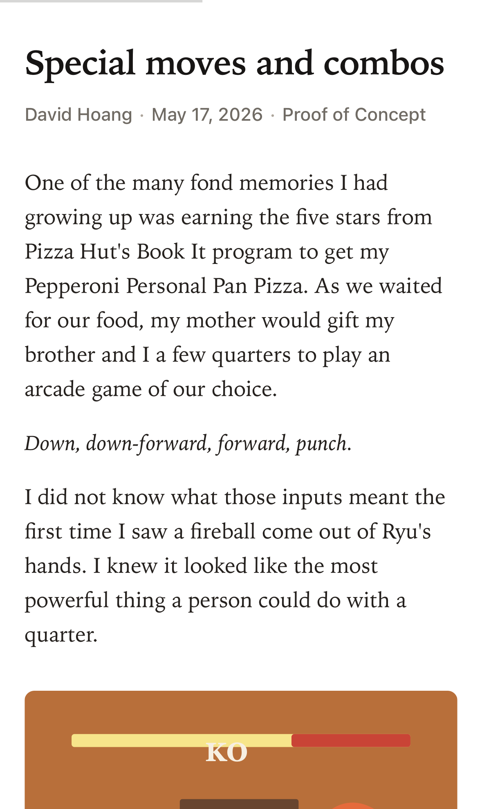

# Calm

A quiet serif theme for NetNewsWire on macOS and iOS.

Calm is tuned for long-form reading: a narrow article column, strong editorial headings, soft metadata, restrained links, light and dark appearances, a quiet section rail on wider screens, and a rail-free compact mobile layout.

## Screenshots

| Light | Dark |
| --- | --- |
|  |  |



## Install

Download the latest release:

[Calm.nnwtheme.zip](https://github.com/raisulchowdhury/calm-nnwtheme/releases/latest/download/Calm.nnwtheme.zip)

The same installable zip is also kept at the repository root:

[Calm.nnwtheme.zip](Calm.nnwtheme.zip)

Then open the zip with NetNewsWire, or use NetNewsWire's theme URL scheme after this repository is public:

```text
netnewswire://theme/add?url=https%3A%2F%2Fgithub.com%2Fraisulchowdhury%2Fcalm-nnwtheme%2Freleases%2Flatest%2Fdownload%2FCalm.nnwtheme.zip
```

On macOS, you can also install the bundle manually:

```sh
unzip Calm.nnwtheme.zip
open Calm.nnwtheme
```

## Design Notes

Calm uses the system serif stack that best matches Apple's reader surfaces:

```css
"Iowan Old Style", "Charter", "Bitstream Charter", "Sitka Text", Cambria, Georgia, "Times New Roman", Times, serif
```

The theme includes:

- system light and dark mode
- iOS Dynamic Type support with a small Calm-specific size bump
- section rail on wider screens, using major headings for highly structured articles and scroll-depth markers for simpler articles
- rail-free compact mobile layout for uninterrupted phone reading
- word count and estimated read time footer
- image blending in light mode
- restrained code, table, blockquote, and figure styling

## Development

The source theme lives in:

```text
Calm.nnwtheme/
```

The bundle must contain exactly:

```text
Info.plist
stylesheet.css
template.html
```

Validate changes:

```sh
scripts/validate.sh
```

The validation runner checks:

- `Info.plist` syntax
- theme and preview inline JavaScript syntax
- theme and preview inline JavaScript parity
- root zip content against `Calm.nnwtheme/`

Build an installable zip:

```sh
ditto -c -k --norsrc --keepParent Calm.nnwtheme Calm.nnwtheme.zip
```

The root `Calm.nnwtheme.zip` is committed for direct GitHub access, and GitHub Releases should publish the same rebuilt file.

## Preview

The local preview page is only for screenshots and quick visual checks:

```text
preview/index.html
```

It uses the real theme stylesheet from `Calm.nnwtheme/stylesheet.css`.

## Credits

Made by Raisul Chowdhury.

Calm is not affiliated with NetNewsWire, Ranchero Software, or Obsidian.

## License

MIT. See [LICENSE](LICENSE).
